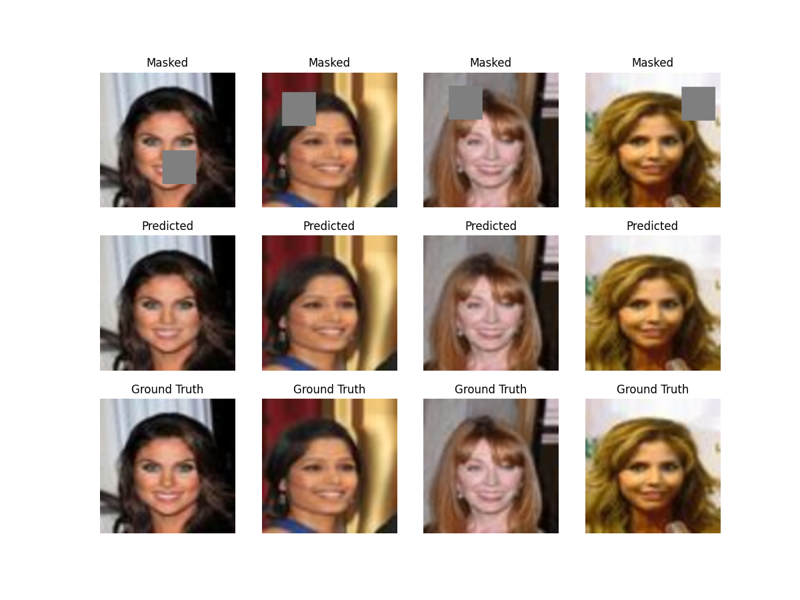
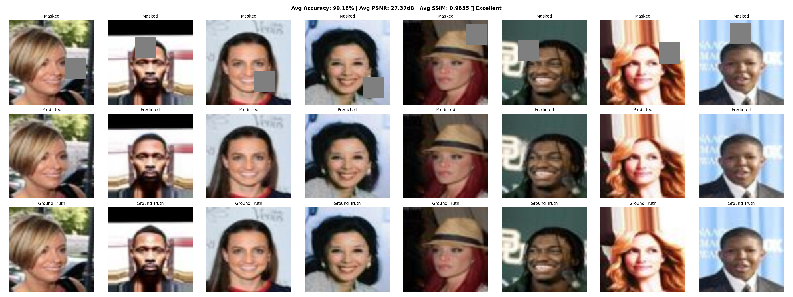

# 🧠 Face Image Inpainting using U-Net

A deep learning project for reconstructing missing regions in facial images using a **U-Net architecture** trained with **PyTorch Lightning** on the **CelebA** dataset. The model learns to fill masked patches while preserving facial structure and visual consistency.

An interactive **Streamlit demo** is included so you can test the model on your own images.

---

## 📸 Sample Output

> Epoch 1 — the model already begins predicting plausible content in the masked region.



| Masked Input | Predicted | Ground Truth |
|:---:|:---:|:---:|
| Image with gray patch | Model reconstruction | Original image |

---

## 📁 Project Structure

```
Image-reconstraction/
│
├── src/                          # Model architecture and training code
├── data/
│   └── processed/                # Preprocessed dataset splits
├── outputs/                      # Saved predictions per epoch
├── lightning_logs/               # PyTorch Lightning training logs
├── archive/                      # Older experiments
├── app.py                        # Streamlit inference app
├── unet.ckpt                     # Trained model checkpoint
├── requirements.txt
├── .gitignore
└── README.md
```

---

## 📦 Dataset

This project uses the **[CelebA](http://mmlab.ie.cuhk.edu.hk/projects/CelebA.html)** dataset — a large-scale face attributes dataset with over 200,000 celebrity images.

All images were resized to **64 × 64** pixels and split using the official CelebA partition file.

| Split | Images |
|-------|-------:|
| Training | 162,770 |
| Validation | 19,867 |
| Test | 19,962 |

> ⚠️ **Note:** Dataset files are **not included** in this repository due to their size. Download CelebA locally and update the dataset paths before running preprocessing.

---

## ⚙️ Preprocessing

The preprocessing pipeline handles:

- Loading the CelebA dataset from disk
- Resizing all images to **64 × 64**
- Verifying image integrity (skipping corrupted files)
- Splitting into train / validation / test sets using the official partition file

---

## 🏗️ Model Architecture

The model is based on the **U-Net** architecture:

- **Encoder** — extracts deep feature maps from the masked input
- **Skip connections** — preserves spatial information across encoder and decoder
- **Decoder** — upsamples features to reconstruct the full image

A random rectangular mask is applied during training. Loss is computed pixel-wise between the predicted output and the original ground truth image.

---
test reslut:

---

## 🚀 Getting Started

### 1. Clone the repository

```bash
git clone https://github.com/ziadahmed789/Image-reconstraction.git
cd Image-reconstraction
```

### 2. Install dependencies

```bash
pip install -r requirements.txt
```

### 3. Prepare the dataset

Download CelebA, place it in the `data/` directory, then run the preprocessing script.

### 4. Train the model

```bash
python src/train.py
```

Training logs are saved automatically to `lightning_logs/`.

---

## 🖥️ Streamlit Demo

Run the interactive inpainting app locally:

```bash
streamlit run app.py
```

Upload any face image → the app applies a random mask and shows the model's reconstruction side by side.

---

## 🛠️ Built With

- [PyTorch](https://pytorch.org/)
- [PyTorch Lightning](https://lightning.ai/)
- [torchvision](https://pytorch.org/vision/)
- [Streamlit](https://streamlit.io/)
- [CelebA Dataset](http://mmlab.ie.cuhk.edu.hk/projects/CelebA.html)

---

## 📬 Contact

**Ziad Ahmed**  
GitHub: [@ziadahmed789](https://github.com/ziadahmed789)

---

## 📄 License

This project is open-source and available under the [MIT License](LICENSE).
